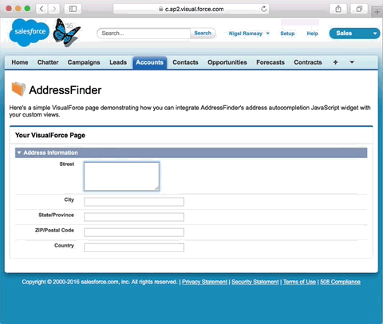

# AddressFinder plugin for Salesforce

Enables Salesforce developers to add autocomplete capability for Australian and New Zealand addresses.

Supported Countries:

* [Australia](https://addressfinder.com.au/?utm_source=salesforce%20plugin&utm_medium=plugin&utm_campaign=plugin&utm_term=Australia&utm_content=Supported%20Countries)
* [New Zealand](https://addressfinder.nz/?utm_source=salesforce%20plugin&utm_medium=plugin&utm_campaign=plugin&utm_term=New%20Zealand&utm_content=Supported%20Countries)

Register for a free AddressFinder account at one of these links:

* [Free Account for Australia](https://portal.addressfinder.io/signup/au/free?utm_source=salesforce%20plugin&utm_medium=plugin&utm_campaign=plugin&utm_term=Australia&utm_content=Free%20Account%20for%20Australia)
* [Free Account for New Zealand](https://portal.addressfinder.io/signup/nz/free?utm_source=salesforce%20plugin&utm_medium=plugin&utm_campaign=plugin&utm_term=New%20Zealand&utm_content=Free%20Account%20for%20New%20Zealand)

Existing users can obtain their API key from the [AddressFinder Portal](https://portal.addressfinder.io/?utm_source=salesforce%20plugin&utm_medium=plugin&utm_campaign=plugin&utm_term=AddressFinder%20Portal&utm_content=existing%20users).

Read more on the AddressFinder [Salesforce Plugin](https://addressfinder.nz/docs/salesforce?utm_source=salesforce%20plugin&utm_medium=plugin&utm_campaign=plugin&utm_term=AddressFinder%20Portal&utm_content=Read%20More) page.

The AddressFinder plugin for Salesforce provides the following features:
- Address autocompletion for New Zealand and Australian Addresses
- Ability to customise the integration on Salesforce pages

## Install Instructions

Follow the instructions below, or watch the [installation video](https://vimeo.com/166301327).

1. Copy our script source:
	- [AddressFinder for Salesforce New Zealand](source/addressfinder_salesforce_nz.js)
	- [AddressFinder for Salesforce Australia](source/addressfinder_salesforce_au.js)
2. Paste the script into your VisualForce page
3. Edit the `CONFIGURATION` block
  1. Enter your AddressFinder license key and country details
  2. Edit the Address field IDs to match your page
  3. Set debug mode (enabled by default).  This displays JS alerts if any of your address field IDs are misconfigured.  
  4. When working successfully, disable debug mode. Any errors will be silently logged to the Javascript console.

#### Implementation Examples

Read and copy our code within the [example VisualForce pages](examples).

## Software License

The AddressFinder plugin for Salesforce is released under the permissive free software [MIT License](LICENSE).
